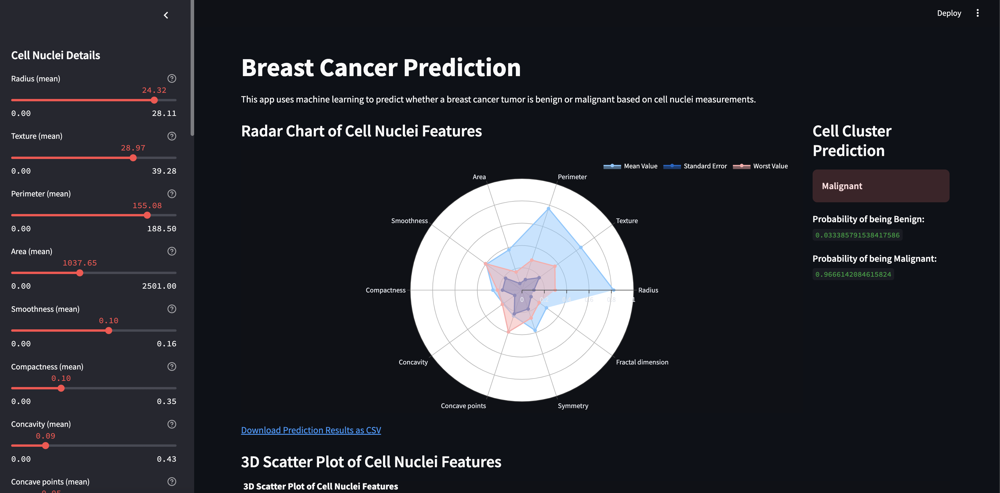
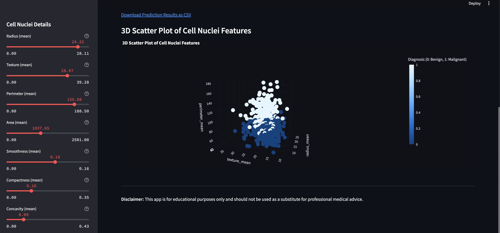
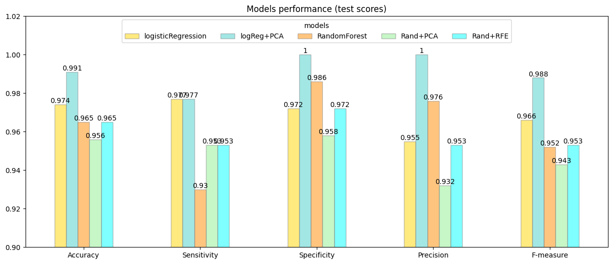
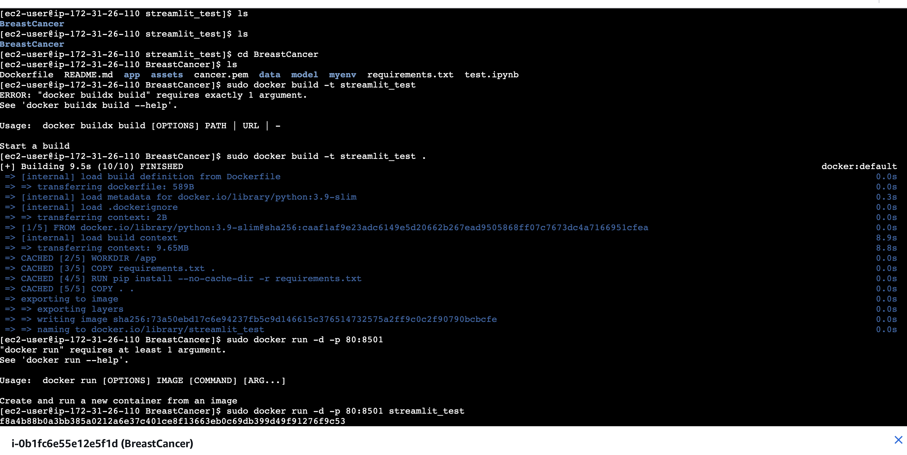

# Breast Cancer Prediction Project 🎗️
## Overview 🔍

This project focuses on building a **machine learning model** to predict whether a breast tumor is **malignant (cancerous)** or **benign (non-cancerous)** based on features extracted from digitized images of fine needle aspirates (FNA) of breast masses. The dataset used in this project is the **Breast Cancer Wisconsin (Diagnostic) Dataset**, which is publicly available from the [UCI Machine Learning Repository](https://archive.ics.uci.edu/ml/datasets/Breast+Cancer+Wisconsin+(Diagnostic)).





The goal of this project is to:

1. **Preprocess and explore the dataset**.
2. **Train and evaluate various machine learning models**.
3. **Deploy the best-performing model for predictions**.

This repository contains the code, datasets, and documentation necessary to replicate the project.

---

## Table of Contents 📚

1. [Dataset](#dataset)
2. [Installation](#installation)
3. [Model Training and Evaluation](#model-training-and-evaluation)
4. [Results](#results)
5. [Deployment on AWS EC2 with Docker](#deployment-on-aws-ec2-with-docker)

---

## Dataset 📊

The dataset used in this project is the **Breast Cancer Wisconsin (Diagnostic) Dataset**. It contains **569 instances** with **30 features** each, computed from digitized images of breast mass FNA. The features describe characteristics of the cell nuclei, such as:

- **Radius**
- **Texture**
- **Perimeter**
- **Area**
- **Smoothness**
- **Compactness**
- **Concavity**
- **Symmetry**
- **Fractal Dimension**

**Target Variable**: `diagnosis` (M = Malignant, B = Benign)  
**Features**: 30 numeric attributes derived from the images.

The dataset is included in the `data/` directory as `data.csv`.

---

## Installation ⚙️

To set up the project, follow these steps:

1. **Clone the repository**:
   ```bash
   git clone https://github.com/your-username/BreastCancer.git
   cd breast-cancer-ml-project
2. **Create a virtual environment**:
   ```bash
   python -m venv venv
   source venv/bin/activate
3. **Install the required dependencies**:
   ```bash
   pip install -r requirements.txt
   
4. **Run streamlit**:
  ```bash
  streamlit run app.py
  ```

## 🚀 Model Training and Evaluation

### 🧠 Models Tested
The following machine learning models were trained and evaluated:

1. **Logistic Regression** 🧮
2. **Logistic Regression + PCA** 📉
3. **Random Forest** 🌳
4. **Random Forest + PCA** 🌳📉
5. **Random Forest + RFE** 🌳🔍

---

### 📊 Evaluation Metrics
The models were evaluated using the following metrics:

1. **Accuracy** 🎯
2. **Sensitivity (Recall)** 🕵️‍♂️
3. **Specificity** 🛡️
4. **Precision** 📏
5. **F-measure (F1 Score)** ⚖️

---

### 📈 Results
The evaluation results are as follows:

- **Logistic Regression** is the **best-performing model** for this dataset, achieving high **accuracy**, **sensitivity**, **specificity**, **precision**, and **F-measure**. 🏆
- **Logistic Regression with PCA** performs slightly worse, indicating that PCA may not be necessary for this dataset. 📉
- **Random Forest** underperforms and requires further tuning or investigation. 🔧



---

## 🛠️ Deployment on AWS EC2 with Docker
This section provides step-by-step instructions for deploying the machine learning model on an **AWS EC2 instance** using **Docker**.

---

### 📋 Prerequisites
Before starting, ensure you have the following:

1. **AWS Account**: You need an AWS account to create an EC2 instance. 🌐
2. **Docker**: Install Docker on your local machine and the EC2 instance. 🐳
3. **AWS CLI**: Install and configure the AWS CLI on your local machine. 🔧

---

Steps
1. Create an EC2 Instance
   Log in to the AWS Management Console.
   
   Navigate to EC2 and click Launch Instance.
   
   Choose an Amazon Machine Image (AMI) with Docker pre-installed (e.g., Amazon Linux 2).
   
   Select an instance type (e.g., t2.micro for free tier).
   
   Configure security groups to allow inbound traffic on port 5000 (for the Flask app).
   
   Launch the instance and download the key pair (.pem file).

2. Connect to the EC2 Instance
Use SSH to connect to your EC2 instance:
```
ssh -i /path/to/your-key.pem ec2-user@<public-ip-address>
```
3. Install Docker on EC2 (if not pre-installed)
```
sudo yum update -y
sudo yum install docker -y
sudo service docker start
sudo usermod -a -G docker ec2-user
```
4. Build and Run the Docker Container
Copy the project files to the EC2 instance using scp:
```
scp -i /path/to/your-key.pem -r /path/to/breast-cancer-ml-project ec2-user@<public-ip-address>:~/
```
SSH into the EC2 instance and navigate to the project directory:
```
cd breast-cancer-ml-project
```
Build the Docker image:
```
docker build -t breast-cancer-ml .
```
Run the Docker container:
```
docker run -d -p 5000:5000 breast-cancer-ml
```
5. Access the Deployed Model
The Streamlit app will be running on port 8501.

Open a browser and navigate to locate to the public ip address



